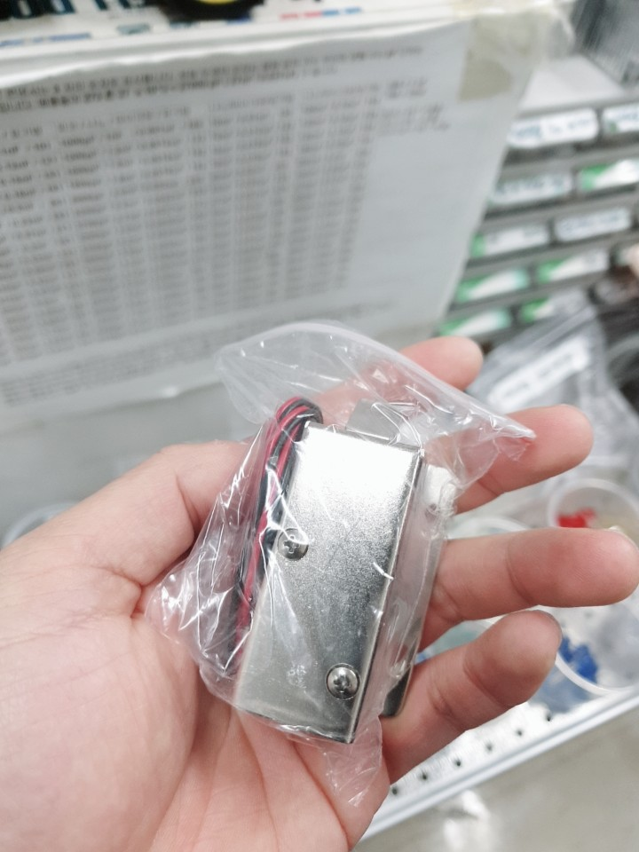
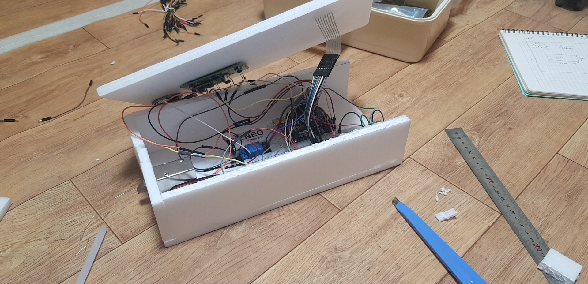
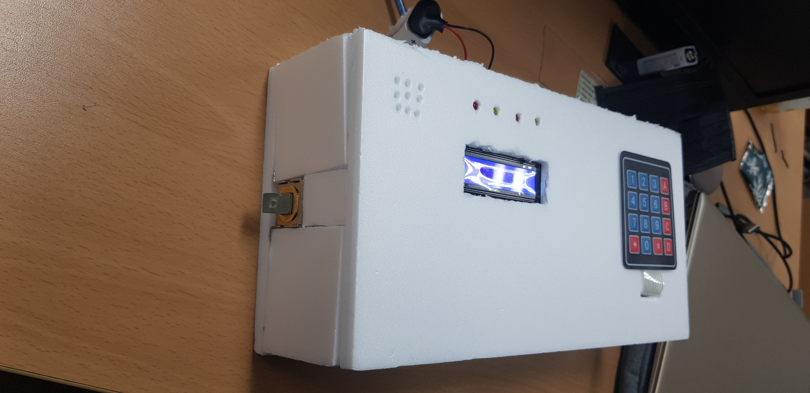

# Arduino_Bluetooth_DoorRock
Arduino

**스크린샷**
---  
  
재료 : [***Arduino Uno Rev3***](https://store.arduino.cc/usa/arduino-uno-rev3) ,[***HC-06***](http://eduino.kr/product/detail.html?product_no=27&cate_no=55&display_group=1&cafe_mkt=naver_ks&mkt_in=Y&ghost_mall_id=naver&ref=naver_open&NaPm=ct%3Djxkh9wk0%7Cci%3D2f5e8e5afe4a5d01b1c764286bfd1c372660d9c8%7Ctr%3Dsls%7Csn%3D444906%7Chk%3D8d8df295ec080177a5f0d7e6756884b3ef99167e) ,[***Arduino Uno Rev3***](https://store.arduino.cc/usa/arduino-uno-rev3) ,[***12V 1-Channel Relay Module***](https://www.amazon.com/HiLetgo-Channel-Isolation-Support-Trigger/dp/B00LW15D1M)  
추가구입 재료 : [***12v solenoid lock***](https://www.ebay.com/itm/DC-12V-mini-electric-solenoid-lock-assembly-for-cabinet-door-/163375954222)
  

제작과정 :  
  
   
  
결과물 :  
  
   
